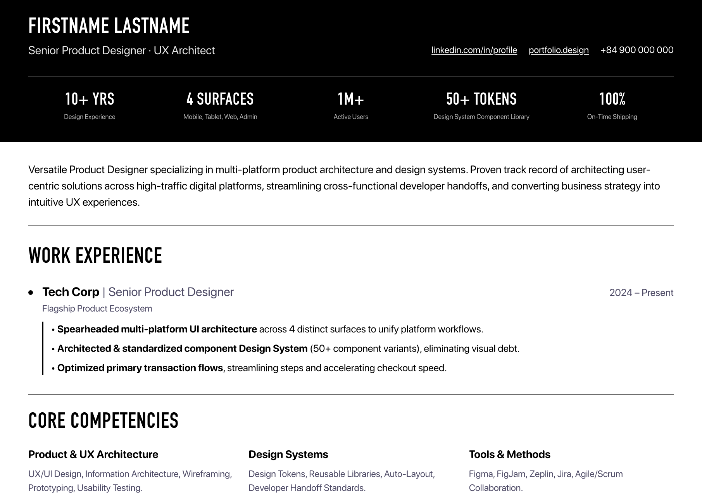
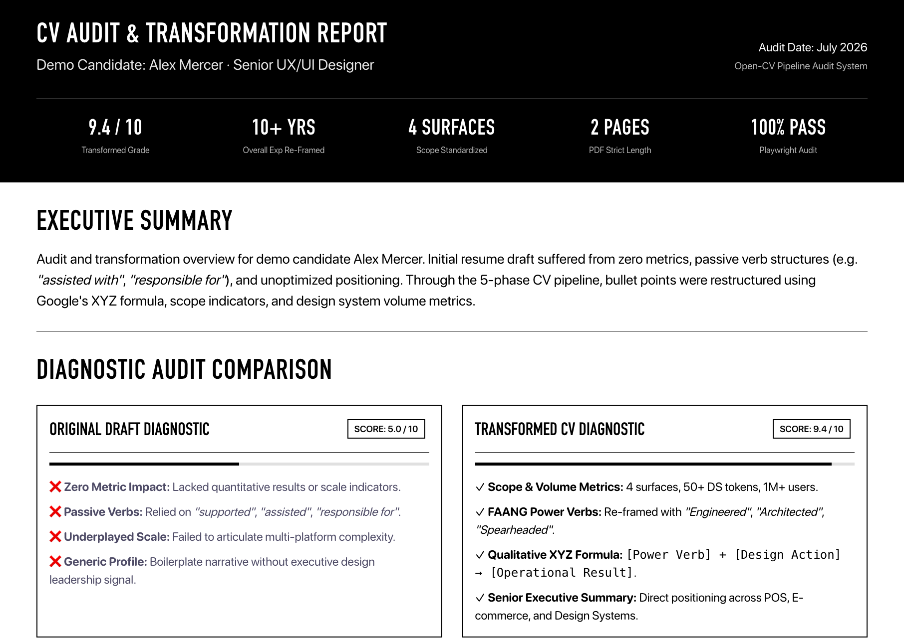
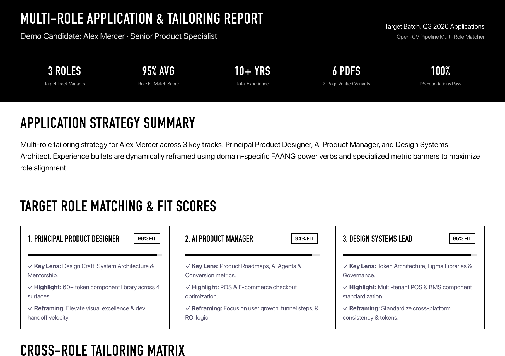
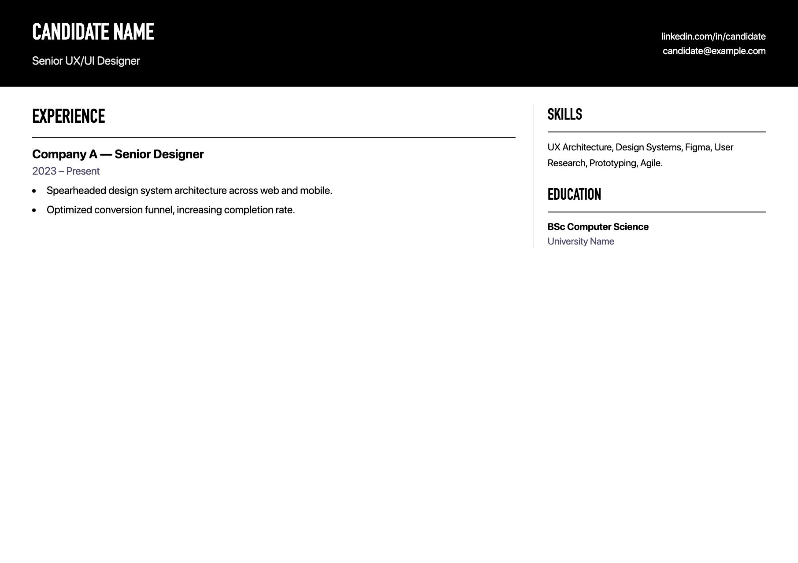

# 📄 Open-CV Pipeline (`open-cv-pipeline`)

> **Automated 5-Phase AI CV Engineering Pipeline** — Research → Tailor → Build → Export → Report.  
> Built for Senior Engineers, Product Managers, & Designers to engineer FAANG-grade CVs with a strict **2-Page PDF Guarantee** and **High-Contrast Monochrome Design System**.

---

## 🖼️ Visual Demo & Previews

### 1. Delivery CV (`v2-modern` Editorial Layout)
High-contrast monochrome typography with DIN Condensed headings, 5-col scope impact banner, and structured timeline dots.



---

### 2. Resume Audit & Transformation Report (`report.html`)
Automated diagnostic report tracking candidate positioning scores, XYZ bullet transformation matrices, and asset verification.



---

### 3. Multi-Role Matching & Application Strategy Report (`report-multi-role.html`)
Evaluates candidate fit scores across multiple role tracks (e.g., Principal Designer, Product Manager, Design Systems Lead) with tailoring strategy matrices.



---

### 4. Alternative Classic Layout (`v1-classic.html`)
2-column layout designed for dense technical backgrounds.



---

## 🌟 Features

- 🔄 **5-Phase Engineering Pipeline:** Structured methodology from initial candidate research to final diagnostic audit report.
- 📐 **Monochrome Design System (`DS-Foundations.md`):** Built-in design tokens, flat design aesthetic, DIN Condensed typography, and 1811px grid layouts.
- ⚡ **Automated Playwright PDF Renderer:** Generates pixel-perfect PDFs with exact 2-page print layout verification (`2560px` height).
- 📊 **Google XYZ Formula & FAANG Verbs:** Embedded rules and prompts to reframe resume bullets with scope metrics and high-impact action verbs.
- 🤖 **AI Agent Ready:** Built-in `.agent/skills/cv-pipeline/SKILL.md` for seamless integration with **Claude Code**, **OpenCode**, **Cursor**, and **Gemini**.

---

## 🚀 Quick Start

### 1. Installation

```bash
git clone https://github.com/jangtrinh/open-cv-pipeline.git
cd open-cv-pipeline
npm install
npx playwright install chromium
```

### 2. Export Sample CVs to PDF

```bash
npm run export:pdf
```

Output PDFs will be generated in `output/`:
- `output/sample-v2-modern.pdf` (Verified 2 Pages ✅)
- `output/sample-v1-classic.pdf` (Verified 2 Pages ✅)

---

## 📁 Repository Architecture

```
open-cv-pipeline/
├── .agent/
│   └── skills/
│       └── cv-pipeline/
│           └── SKILL.md           # AI Agent skill manifest
├── docs/
│   ├── DS-Foundations.md          # Design System specification & typography scale
│   └── cv-workflow.md             # 5-Phase CV lifecycle detailed guide
├── scripts/
│   └── export-pdf.mjs             # Playwright Chromium PDF rendering engine
├── templates/
│   ├── cv-template.md             # XYZ formula starter markdown resume
│   ├── v2-modern.html             # Editorial single-column HTML layout
│   ├── v1-classic.html             # 2-column Figma-style HTML layout
│   └── report.html                # Application audit & diagnostic report template
├── package.json
├── LICENSE                        # MIT License
└── README.md
```

---

## 🎨 Design System Quick Reference

| Token | Hex | Usage |
| :--- | :--- | :--- |
| `color-bg-primary` | `#ffffff` | Page background |
| `color-bg-inverse` | `#000000` | Header & metric banner background |
| `color-text-primary` | `#000000` | Headings & primary text |
| `color-text-secondary` | `#4e4b66` | Dates, company subtitles, metadata |

### Typography Scale
- **Headings:** `DIN Condensed` (56px, uppercase, 700 weight)
- **Body:** `SF Pro Rounded` (26–28px, 400 weight)
- **Container Geometry:** `max-w-[1811px]`, `px-[73px]` horizontal padding

---

## 💡 Google XYZ Formula Reference

Transform weak bullets into high-impact accomplishment statements:

$$\text{[FAANG Power Verb]} + \text{[What you built]} \rightarrow \text{[Quantified / Scope Outcome]}$$

* **Weak:** *Responsible for designing mobile app and design system.*
* **Strong (Scope Indicator):** *Architected cross-platform UI across 4 surfaces (iOS, Android, Tablet, Web Admin) and standardized 60+ design system tokens → eliminated visual drift and accelerated dev handoff.*

---

## 📜 License

This project is open-source under the [MIT License](LICENSE).
